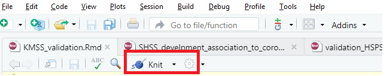

# **Conspiracy belief about the COVID-19 pandemic and their link to personality traits and cognitive abilities**

To fully reproduce the study results, there is need to undertake the following steps:

# 1. Instal R and R studio:

[Instal R 4.0.5 version](https://cran.r-project.org/bin/windows/base/old/4.0.5/R-4.0.5-win.exe) and [R studio](https://download1.rstudio.org/desktop/windows/RStudio-1.4.1717.exe) for windows or for masOS [R](https://cran.r-project.org/bin/macosx/old/Mac-GUI-1.14.tar.gz) and [R studio](https://download1.rstudio.org/desktop/macos/RStudio-1.4.1717.dmg). If you already have R and R studio, you can skip this step.

# 2. Open R studio

# 3. Copy the following link: <https://gitlab.com/lukas.novak/conspiracy-belief-about-the-covid-19-pandemic-and-their-link-to-cognitive-abilities.git>

# 4. In R studio, click on "create a project" icon → Version control (see image below)

# 4. Click on "git" (see image below)

# 5. Insert the link copied in the [step 3](#3-copy-the-following-link-httpsgitlabcomlukasnovakiri-validation-czgit) into the Repository URL (see image below)

# 6. Click on "create project" - **OPENING A NEW PROJECT CAN TAKE A FEW MINUTES!**

# 7. In the new project click on "knit" button (see image below)

